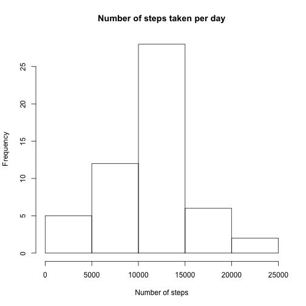
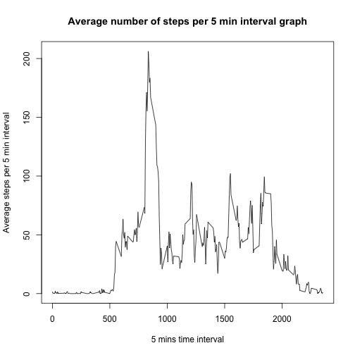
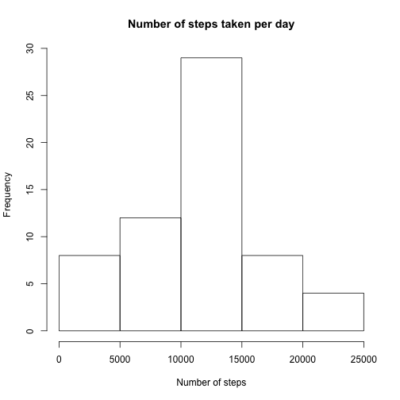
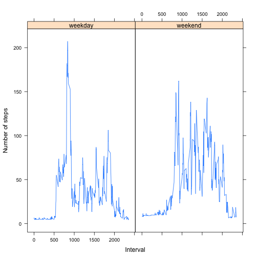

### Reproducible Research - Peer Assignment - 1
### Dataset
The variables included in this dataset are:

- **steps** : Number of steps taking in a 5-minute interval (missing values are coded as NA)

- **date**: The date on which the measurement was taken in YYYY-MM-DD format

- **interval**: Identifier for the 5-minute interval in which measurement was taken

The dataset is stored in a comma-separated-value (CSV) file and there are a total of 17,568 observations in this dataset.

This reproducible research trying to answer the following questions,  

1. Loading and preprocessing the data  
2. What is mean total number of steps taken per day?  
3. What is the average daily activity pattern?  
4. Imputing missing values  
5. Are there differences in activity patterns between weekdays and weekends?  


### Loading and preprocessing the data

The following code reads the 'activity.csv' file.


```r
file<-read.csv(file='activity.csv',colClasses=c("numeric","Date","numeric"))
```

*steps* has NA values. The following code creates the preprocessed file by removing the NA values of steps

```r
fileProcessed<-file[!is.na(file$steps),]
```

The following code converts the data frame *fileProcessed* into a data table *dt*. *data.table* requires the package *data.table*.

```r
library(data.table)
dt<-data.table(fileProcessed)
```

### What is mean total number of steps taken per day? ###

The following code calculates the *mean* of steps for every date.

```r
byDate <- dt[,sum(steps),by="date"]
```

The following code plots the histogram with average number of steps with the frequency

```r
hist(byDate$V1,xlab="Number of steps",main="Number of steps taken per day")
```

 

The mean of the total number of steps taken per day is,

```r
mean(byDate$V1)
```

```
## [1] 10766
```
The median of the total number of steps taken per day is,

```r
median(byDate$V1)
```

```
## [1] 10765
```
### What is the average daily activity pattern? ###

The following code calculates the average number of steps by *interval* and plots the time series plot with the mean against the interval


```r
byInterval<-dt[,mean(steps),by="interval"]
plot(x=byInterval$interval,y=byInterval$V1,type="l",xlab="5 mins time interval",ylab="Average steps per 5 min interval",main="Average number of steps per 5 min interval graph")
```

 

The following code finds the interval which has maximum number of average steps,

```r
byInterval[max(byInterval$V1) == V1,]$interval
```

```
## [1] 835
```
### Imputing missing values ###
The number of rows which has the *NA* in the steps is,

```r
nrow(file[is.na(file$steps),])
```

```
## [1] 2304
```

The following code fills the *NA* values of steps with the average number of steps of the *interval* and creates a new dateset with *NA* values.


The following code calulates the average number of steps by date on the new dataset.

```r
dtNew<-data.table(file)
byDateNew <- dtNew[,sum(steps),by="date"]
```


The mean of the total number of steps taken per day in the new dataset is,

```r
mean(byDateNew$V1)
```

```
## [1] 10890
```
The median of the total number of steps taken per day in the new dataset is,

```r
median(byDateNew$V1)
```

```
## [1] 11015
```

As the *NA* values have been filled with the a value, there is a difference in *mean* and *median* values and they got increased by filling a value for *NA*.


```r
hist(byDateNew$V1,xlab="Number of steps",main="Number of steps taken per day")
```

 

There is a significant raise in the ranges between 0 to 5000 and 20000 to 25000 due to the filling of values for *NA*
### Are there differences in activity patterns between weekdays and weekends? ###

The following code, creates a *weektime* column in the original dataset which marks a record with *weekday* or *weekend*

```r
file$weektime <- as.factor(ifelse(weekdays(file$date) %in% c("Saturday","Sunday"),"weekend", "weekday"))
```

The following code converts the dataset into the data table and calculates the average number of steps by interval and weektime.

```r
dtForPlot<-data.table(file)
data<-dtForPlot[,mean(steps),by="interval,weektime"]
```

The following code uses the *lattice* plotting systems to plot the graph with mean and interval against weektime.

```r
library(lattice)
xyplot(V1 ~ interval | weektime ,data, type="l",xlab="Interval",ylab="Number of steps")
```

 

From the above plot, in the *weekend* the number of steps are increased in the range 1000 to 25000 which shows that people are more active in the weekend than in the weekdays.
 
